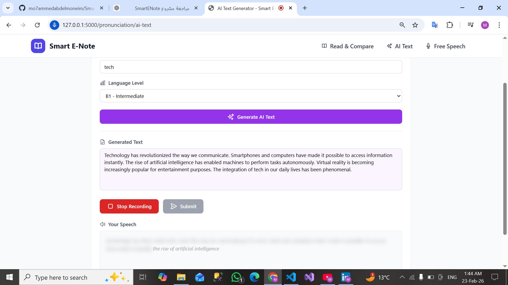
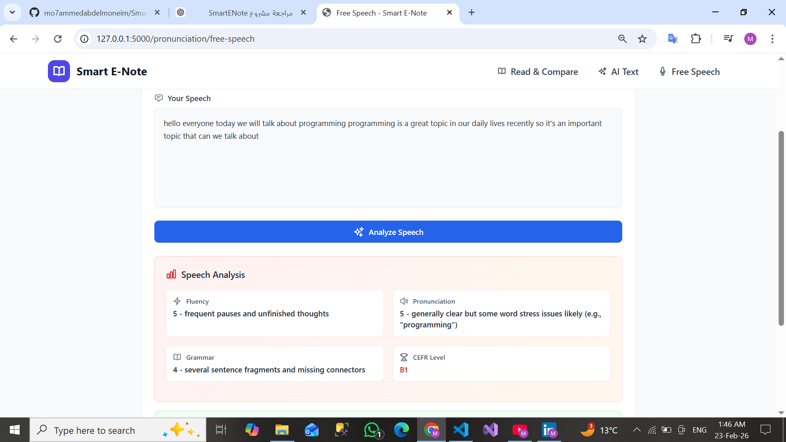

<div align="center">

<h1>📘 Smart E-Note</h1>
<p><strong>An AI-Powered Learning & Language Practice Platform</strong></p>

<p>
  
  
  
  
  
</p>

<p>
  
  
  
</p>

<br/>

> **Smart E-Note** combines structured learning content, AI intelligence, and browser-based speech interaction to create a complete, practical language learning environment — helping users learn effectively, speak confidently, and improve continuously.

</div>

---

## 📸 Screenshots

| AI Generation | AI Generation | Free Speech |
|:---------:|:--------------------:|:--------------:|
|  |  |  |

---

## 📋 Table of Contents

- [Overview](#-overview)
- [Core Features](#-core-features)
- [Pronunciation Module](#️-pronunciation-module)
- [Tech Stack](#️-tech-stack)
- [Architecture](#-system-architecture)
- [Getting Started](#-getting-started)
- [Project Structure](#-project-structure)
- [Author](#-author)

---

## 🎯 Overview

Smart E-Note is a modern, full-stack web application built to help language learners improve their reading, comprehension, and spoken communication skills. It blends **structured learning programs** with **AI-driven tools** — including a language assistant, adaptive quizzes, and a three-mode pronunciation engine — into a single, cohesive platform.

**Who is it for?** Learners at any level (A1–C2) who want to go beyond passive reading and actively practice language in an intelligent, feedback-driven environment.

---

## 🌟 Core Features

### 1. Programs
Organized, multi-lesson learning paths that guide learners step-by-step through a subject. Easy navigation between lessons within the same program makes it suitable for long-term study.

### 2. General Learning Content
Standalone educational topics outside structured programs, served in a clean, distraction-free reading interface. Any content page can be used directly with the Quiz or Pronunciation features.

### 3. Language Assistant (AI Tutor)
An embedded AI assistant available on every content page. It helps learners understand difficult vocabulary, rephrase sentences, explain grammar rules, and act as an on-demand personal tutor — all without leaving the current lesson.

### 4. Quiz & Quick Quiz
Generate quizzes from any topic or content page with configurable options:
- Number of questions
- Difficulty level (easy / medium / hard)
- Instant feedback and scoring after each attempt

---

## 🎙️ Pronunciation Module

The most advanced feature of Smart E-Note — a three-mode pronunciation trainer powered by the **Web Speech API** and backend AI analysis.

### 🔹 Read & Compare
Users supply their own text, read it aloud, and receive detailed feedback:
- Side-by-side comparison of original vs. transcribed text
- Identification of mispronounced or skipped words
- Accuracy / similarity percentage score

### 🔹 AI Text Generator (A1 → C2)
AI generates a custom reading passage based on:
- A chosen topic (e.g., travel, technology, daily life)
- A selected CEFR proficiency level (A1 through C2)

Users then read the passage aloud and receive evaluation of pronunciation, clarity, and correctness — ideal for structured, level-appropriate speaking practice.

### 🔹 Free Speech Practice
No predefined text required. Users speak freely on any subject and receive AI analysis of:
- Logical flow and coherence
- Sentence structure and grammar
- Overall clarity
- A composite quality score with actionable feedback

---

## 🛠️ Tech Stack

| Layer | Technology |
|-------|-----------|
| **Backend** | Python, Flask |
| **Frontend** | HTML5, Tailwind CSS, Vanilla JavaScript |
| **Speech Recognition** | Web Speech API (browser-native, client-side) |
| **AI Features** | Text generation, text comparison, pronunciation evaluation, language assistance |

> Speech recognition runs entirely in the browser — only processed text is sent to the backend, keeping latency low and the architecture simple.

---

## 🧠 System Architecture

```
Browser (Client-Side)
├── Audio Recording
├── Speech Recognition  ←──  Web Speech API
└── Text Payload
         │
         ▼
Flask Backend (Server-Side)
├── AI Text Generation
├── Quiz Generation
├── Text Comparison Engine
├── Pronunciation Analyzer
└── Feedback & Scoring
```

**Key design principle:** Speech-to-text conversion happens on the client. The server only processes text, which keeps the backend lightweight and responses fast.

---

## 🚀 Getting Started

### Prerequisites

- Python 3.10+
- `pip` and `virtualenv`
- A modern browser with Web Speech API support (Chrome recommended)

### Installation

```bash
# 1. Clone the repository
git clone https://github.com/your-username/smart-e-note.git
cd smart-e-note

# 2. Create and activate a virtual environment
python -m venv venv

# On Windows:
venv\Scripts\activate

# On macOS/Linux:
source venv/bin/activate

# 3. Install dependencies
pip install -r requirements.txt

# 4. Run the application
python app.py
```

### Access

Open your browser and navigate to:

```
http://127.0.0.1:5000
```

---

## 📁 Project Structure

```
smart-e-note/
├── app.py                  # Flask application entry point
├── requirements.txt        # Python dependencies
├── routs/
│   ├── program.py                
│   └── general.py ......               
├── templates/
│   ├── index.html          # Main layout
│   ├── programs/           # Program & lesson templates
│   ├── quiz/               # Quiz templates
│   └── pronunciation/      # Pronunciation module templates
└── README.md
```

---

## 📱 Responsive Design

Smart E-Note is built mobile-first and tested across:

- 📱 Mobile phones
- 📟 Tablets
- 🖥️ Desktops

Adaptive navigation switches between desktop and mobile menus automatically. Consistent styling is maintained throughout via Tailwind CSS utility classes.

---

## 🤝 Contributing

Contributions, issues, and feature requests are welcome. Please open an issue first to discuss what you would like to change.

1. Fork the repository
2. Create your feature branch (`git checkout -b feature/your-feature`)
3. Commit your changes (`git commit -m 'Add your feature'`)
4. Push to the branch (`git push origin feature/your-feature`)
5. Open a Pull Request

---

## 📄 License

This project is licensed under the [MIT License](LICENSE).

---

## 👤 Author

**Mohammed Abd-Elmoneim**
Backend Developer · AI & Web Enthusiast

<p>
  <a href="https://github.com/mo7ammedabdelmoneim">
    
  </a>
  &nbsp;
  <a href="https://linkedin.com/in/mohammed-abdelmoneim">
    
  </a>
</p>

---

<div align="center">
  <sub>Built with ❤️ to make language learning smarter and more interactive.</sub>
</div>
